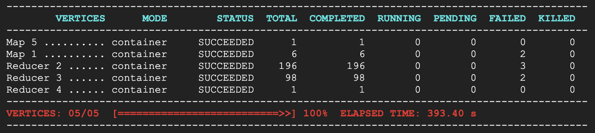
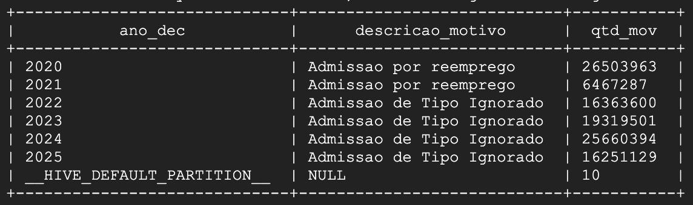
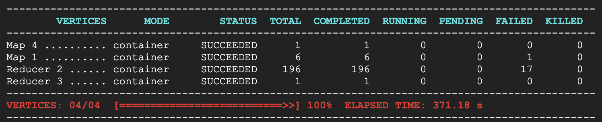
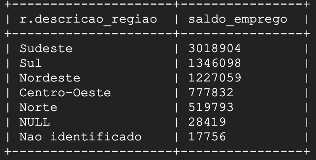
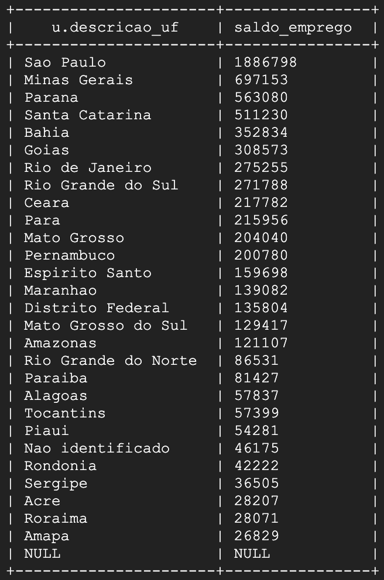
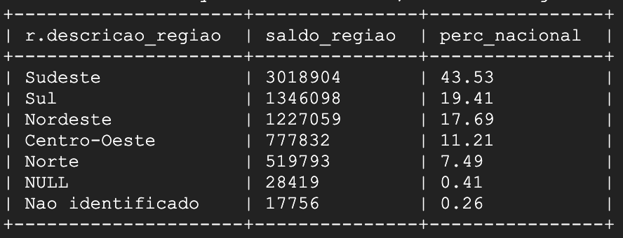

# Projeto Infraestrutura Hadoop

- Disciplina: [25E3_2]
- Nathalia Castelo Branco

## Tema

Análise do mercado formal de trabalho no Brasil com base nos dados do CAGED: admissões, desligamentos e saldo de empregos.

## Origem dos dados

[Microdados RAIS CAGED](https://www.gov.br/trabalho-e-emprego/pt-br/assuntos/estatisticas-trabalho/microdados-rais-e-caged)

Os dados foram obtidos via download por FTP, conforme orientação do site: https://www.gov.br/trabalho-e-emprego/pt-br/assuntos/estatisticas-trabalho/microdados-rais-e-caged

## Dicionário de dados

### Base de movimentações
Layout dos Microdados Não-Identificados do Novo CAGED - Base de Movimentações

| Variável              | Descrição                                                                 | Código              |
|------------------------|---------------------------------------------------------------------------|---------------------|
| competênciamov         | Competência da movimentação (anteriormente competência)                   | `<AAAAMM>`            |
| região                 | Região geográfica de acordo com o código do IBGE                         | <99>                |
| uf                     | Unidade da federação de acordo com o código do IBGE                      | <99>                |
| município              | Código do Município                                                      | <999999>            |
| seção                  | Código da seção da classificação nacional de atividade econômica (CNAE 2.0) | `<N>`               |
| subclasse              | Código da subclasse da classificação nacional de atividade econômica (CNAE 2.0) | <9999999>      |
| saldomovimentação      | Valor da movimentação em termos de saldo                                  | <99>                |
| categoria              | Categoria de trabalhador                                                  | <999>               |
| cbo2002ocupação        | Código da ocupação do trabalhador de acordo com a CBO 2002               | <999999>            |
| graudeinstrução        | Grau de instrução do trabalhador                                          | <99>                |
| idade                  | Idade do trabalhador                                                     | <999>               |
| horascontratuais       | Horas contratuais semanais                                                | <99>                |
| raçacor                | Raça ou cor do trabalhador                                                | <9>                 |
| sexo                   | Sexo do trabalhador                                                      | <9>                 |
| tipoempregador         | Tipo de empregador                                                        | <9>                 |
| tipoestabelecimento    | Tipo de estabelecimento                                                   | <9>                 |
| tipomovimentação       | Tipo de movimentação                                                      | <99>                |
| tipodedeficiência      | Tipo de deficiência do trabalhador                                        | <9>                 |
| indtrabintermitente    | Indicador de trabalhador intermitente                                     | <9>                 |
| indtrabparcial         | Indicador de trabalhador parcial                                          | <9>                 |
| salário                | Salário mensal declarado                                                  | <999999999,99>      |
| tamestabjan            | Faixa de Emprego no início de Janeiro do Estabelecimento                 | <99>                |
| indicadoraprendiz      | Indicador de trabalhador aprendiz                                         | <9>                 |
| origemdainformação     | Origem da informação da movimentação                                      | <9>                 |
| competênciadec         | Competência da declaração                                                 | `<AAAAMM>`            |
| competênciaexc         | Competência da exclusão                                                   | `<AAAAMM>`            |
| indicadordeexclusão    | Indicador de Exclusão                                                     | <9>                 |
| indicadordeforadoprazo | Indicador de informação declarada fora do prazo                           | <9>                 |
| unidadesaláriocódigo   | Unidade de pagamento da parte fixa da remuneração                         | <99>                |
| valorsaláriofixo       | Salário base do trabalhador, correspondente à parte fixa da remuneração   | <999999999,99>      |


## Obtenção dos dados

O processo de ELT foi desenvolvido conforme arquivo `ELT_CAGED_Hadoop.ipynb`. Nele os dados foram baixados via FTP, descompactados, consolidados em Parquet e enviados ao Google Cloud Storage. 

Print dos dados armazenados no Bucket na Google Cloud Storage:


### Particionamento para otimização de consultas

Visando otimizar as consultas no Hive devido ao tamanho dos arquivos, outro processamento foi desenvolvido, dessa vez com ajuda de PySpark via Google Colab. Os scripts de transformação dos dados estão no arquivo `Transformacao_CAGED.ipynb`. 

Os arquivos gerados desta transformação que foram carregados na tabela fato do CAGED.


# Criação do Cluster no Dataproc

O cluster criado foi de nó único


Criação da pasta HOME para o meu usuário:
```bash
hdfs dfs -mkdir /user/nathalia_branco
```


Acessando Hive via Beeline:
```bash
beeline -u jdbc:hive2://localhost:10000/default -n nathalia_branco -d org.apache.hive.jdbc.HiveDriver
```


Criação da DATABASE:
```bash
CREATE DATABASE caged_db
LOCATION 'gs://bucket_caged/hive/caged_db/';
```


Describe na database:
```bash
DESCRIBE DATABASE caged_db;
```


# Criação de tabelas no Hive

## Tabela Fato: Admissões e demissões

- No GCS: `gs://bucket_caged/caged_unificado/`

### Script para tabela no Hive
```sql
CREATE EXTERNAL TABLE fato_caged (
  competenciamov        BIGINT,
  competenciaexc        BIGINT,
  regiao                BIGINT,
  uf                    BIGINT,
  municipio             STRING,
  secao                 STRING,
  subclasse             BIGINT,
  saldomovimentacao     BIGINT,
  cbo2002ocupacao       BIGINT,
  categoria             BIGINT,
  graudeinstrucao       BIGINT,
  idade                 DOUBLE,
  horascontratuais      STRING,
  racacor               BIGINT,
  sexo                  BIGINT,
  tipoempregador        BIGINT,
  tipoestabelecimento   BIGINT,
  tipomovimentacao      BIGINT,
  tipodeficiencia       BIGINT,
  indtrabintermitente   BIGINT,
  indtrabparcial        BIGINT,
  salario               STRING,
  tamestabjan           BIGINT,
  indicadoraprendiz     BIGINT,
  origemdainformacao    BIGINT,
  indicadordeforadoprazo BIGINT,
  unidadesalariocodigo  BIGINT,
  valorsalariofixo      STRING,
  indicadordeexclusao   BIGINT,

  -- novas colunas
  ano_mov               STRING,
  natureza_evento       STRING,
  impacto_saldo         BIGINT,
  faixa_etaria          STRING
)
PARTITIONED BY (
  ano_dec STRING,
  competenciadec STRING,
  origem_declaracao STRING
)
STORED AS PARQUET
LOCATION 'gs://bucket_caged/caged_unificado/';
```

Carregar partições:
```sql
MSCK REPAIR TABLE fato_caged;
```
## Dimensões

## Região

- Arquivo: `dim_regiao.csv`
- No GCS: `gs://bucket_caged/dimensoes/dim_regiao/dim_regiao.csv`


### Script para tabela no Hive
```sql
CREATE EXTERNAL TABLE dim_regiao (
  regiao INT,
  descricao_regiao STRING
)
ROW FORMAT DELIMITED
FIELDS TERMINATED BY ','
STORED AS TEXTFILE
LOCATION 'gs://bucket_caged/dimensoes/dim_regiao/';
```

```sql
SELECT * FROM caged_db.dim_regiao LIMIT 10;
```


## UF

- Arquivo: `dim_uf.csv`
- No GCS: `gs://bucket_caged/dimensoes/dim_uf/dim_uf.csv`

### Script para tabela no Hive
```sql
CREATE EXTERNAL TABLE dim_uf (
  uf INT,
  descricao_uf STRING
)
ROW FORMAT DELIMITED
FIELDS TERMINATED BY ','
STORED AS TEXTFILE
LOCATION 'gs://bucket_caged/dimensoes/dim_uf/';
```
```sql
SELECT * FROM caged_db.dim_uf LIMIT 10;
```


## Seção
- Arquivo: `dim_secao.csv`
- No GCS: `gs://bucket_caged/dimensoes/dim_secao/dim_secao.csv`

### Script para tabela no Hive
```sql
CREATE EXTERNAL TABLE dim_secao (
  secao STRING,
  descricao_secao STRING
)
ROW FORMAT DELIMITED
FIELDS TERMINATED BY ';'
STORED AS TEXTFILE
LOCATION 'gs://bucket_caged/dimensoes/dim_secao/';
```

```sql
SELECT * FROM caged_db.dim_secao LIMIT 10;
```


## Motivo de movimentação (Admissão ou demissão)

- Arquivo: `dim_motivo.csv`
- No GCS: `gs://bucket_caged/dimensoes/dim_motivo/dim_motivo.csv`

### Script para tabela no Hive
```sql
CREATE EXTERNAL TABLE dim_motivo (
  tipomovimentacao INT,
  descricao_motivo STRING
)
ROW FORMAT DELIMITED
FIELDS TERMINATED BY ';'
STORED AS TEXTFILE
LOCATION 'gs://bucket_caged/dimensoes/dim_motivo/';
```

```sql
SELECT * FROM caged_db.dim_motivo LIMIT 10;
```


## Grau de instrução

- Arquivo: `dim_graudeinstrucao.csv`
- No GCS: `gs://bucket_caged/dimensoes/dim_graudeinstrucao/dim_graudeinstrucao.csv`

### Script para tabela no Hive
```sql
CREATE EXTERNAL TABLE dim_graudeinstrucao (
  graudeinstrucao INT,
  descricao_instrucao STRING
)
ROW FORMAT DELIMITED
FIELDS TERMINATED BY ';'
STORED AS TEXTFILE
LOCATION 'gs://bucket_caged/dimensoes/dim_graudeinstrucao/';
```

```sql
SELECT * FROM caged_db.dim_graudeinstrucao LIMIT 10;
```


## CBO - Classificação Brasileira de Ocupação

- Arquivo: `dim_cbo.csv`
- No GCS: `gs://bucket_caged/dimensoes/dim_cbo/dim_cbo.csv`

### Script para tabela no Hive
```sql
CREATE EXTERNAL TABLE dim_cbo (
  cbo STRING,
  descricao_cbo STRING
)
ROW FORMAT DELIMITED
FIELDS TERMINATED BY ';'
STORED AS TEXTFILE
LOCATION 'gs://bucket_caged/dimensoes/dim_cbo/';
```

```sql
SELECT * FROM caged_db.dim_cbo LIMIT 10;
```


## Todas as tabelas no Hive:


# Respondendo perguntas com Hive
O período analisado foi de 2020 a 2025.

## Admissões e desligamentos
### 1. Quantas admissões e desligamentos ocorreram em cada ano?
```sql
SELECT 
    f.ano_dec,
    m.descricao_motivo,
    COUNT(*) AS qtd_mov
FROM fato_caged f
LEFT JOIN dim_motivo m
    ON f.tipomovimentacao = m.tipomovimentacao
GROUP BY f.ano_dec, m.tipomovimentacao, m.descricao_motivo
ORDER BY f.ano_dec, qtd_mov DESC;
```


### 2. Qual foi o principal motivo de movimentação em cada ano?
```sql
WITH ranked AS (
    SELECT 
        f.ano_dec,
        m.descricao_motivo,
        COUNT(*) AS qtd_mov,
        ROW_NUMBER() OVER (PARTITION BY f.ano_dec ORDER BY COUNT(*) DESC) AS rn
    FROM fato_caged f
    LEFT JOIN dim_motivo m
        ON f.tipomovimentacao = m.tipomovimentacao
    GROUP BY f.ano_dec, m.descricao_motivo
)
SELECT ano_dec, descricao_motivo, qtd_mov
FROM ranked
WHERE rn = 1
ORDER BY ano_dec;
```




## Saldo de movimentações por região e UF

### 3. Quais regiões geraram mais empregos ao longo do período analisado?
```sql
SELECT 
    r.descricao_regiao,
    SUM(f.saldomovimentacao) AS saldo_emprego
FROM fato_caged f
LEFT JOIN dim_regiao r
    ON f.regiao = r.regiao
GROUP BY r.descricao_regiao
ORDER BY saldo_emprego DESC;
```




### 4. Em quais estados o saldo de empregos foi mais positivo ou negativo?
```sql
SELECT 
    u.descricao_uf,
    SUM(f.saldomovimentacao) AS saldo_emprego
FROM fato_caged f
LEFT JOIN dim_uf u
    ON f.uf = u.uf
GROUP BY u.descricao_uf
ORDER BY saldo_emprego DESC;
```


### 5. Existe alguma concentração de saldo de empregos em determinada região do país?
```sql
SELECT 
    r.descricao_regiao,
    SUM(f.saldomovimentacao) AS saldo_regiao,
    ROUND(100.0 * SUM(f.saldomovimentacao) / SUM(SUM(f.saldomovimentacao)) OVER (), 2) AS perc_nacional
FROM fato_caged f
LEFT JOIN dim_regiao r
    ON f.regiao = r.regiao
GROUP BY r.descricao_regiao
ORDER BY perc_nacional DESC;
```


# Limitação da instância prejudicou a execução das queries a partir daqui. Incluídas na proposta de evolução do trabalho
## Distribuição por setor econômico

### 6. Quais setores da economia mais contrataram ou desligaram trabalhadores em 2025?
```sql
SELECT 
    s.descricao_secao,
    COUNT(*) AS qtd_mov
FROM fato_caged f
LEFT JOIN dim_secao s
    ON f.secao = s.secao
GROUP BY s.descricao_secao
ORDER BY qtd_mov DESC;
```

Teste de envio de Job:
```
gcloud dataproc jobs submit hive \
  --cluster=cluster-caged \
  --region=us-central1 \
  --execute="USE caged_db;
             SELECT 
                  s.descricao_secao,
                  COUNT(*) AS qtd_mov
              FROM fato_caged f
              LEFT JOIN dim_secao s
                  ON f.secao = s.secao
              WHERE f.ano_dec = 2025
                AND f.origem_declaracao = 'PRAZO'
              GROUP BY s.descricao_secao
              ORDER BY qtd_mov DESC
              LIMIT 10;"
```

### 7. Qual setor apresentou o maior saldo líquido de empregos?
```sql
SELECT 
    s.descricao_secao,
    SUM(f.saldomovimentacao) AS saldo_emprego
FROM fato_caged f
LEFT JOIN dim_secao s
    ON f.secao = s.secao
GROUP BY s.descricao_secao
ORDER BY saldo_emprego DESC
LIMIT 1;
```


### 8. Há setores que consistentemente apresentam saldos negativos?
```sql
SELECT 
    f.ano_dec,
    s.descricao_secao,
    SUM(f.saldomovimentacao) AS saldo_emprego
FROM fato_caged f
LEFT JOIN dim_secao s
    ON f.secao = s.secao
GROUP BY f.ano_dec, s.descricao_secao
HAVING SUM(f.saldomovimentacao) < 0
ORDER BY s.descricao_secao, f.ano_dec;
```
## Escolaridade dos admitidos

### 9. Qual é o nível de escolaridade predominante entre os admitidos?
```sql
SELECT 
    g.descricao_graudeinstrucao,
    COUNT(*) AS qtd
FROM fato_caged f
LEFT JOIN dim_graudeinstrucao g
    ON f.graudeinstrucao = g.graudeinstrucao
WHERE f.tipomovimentacao IN (10, 20, 25, 35, 70, 97)
GROUP BY g.descricao_graudeinstrucao
ORDER BY qtd DESC
LIMIT 1;
```
### 10. O perfil de escolaridade dos admitidos mudou ao longo dos anos?
```sql
SELECT 
    f.ano_dec,
    g.descricao_graudeinstrucao,
    COUNT(*) AS qtd
FROM fato_caged f
LEFT JOIN dim_graudeinstrucao g
    ON f.graudeinstrucao = g.codigo
WHERE f.tipomovimentacao IN (10, 20, 25, 35, 70, 97)
GROUP BY f.ano_dec, g.descricao_graudeinstrucao
ORDER BY f.ano_dec, qtd DESC;
```

### 11. Trabalhadores com ensino superior têm participação relevante nas admissões?
```sql
SELECT 
    f.ano_dec,
    CASE 
        WHEN g.graudeinstrucao >= 9 THEN 'Nível Superior Completo ou acima'
        ELSE 'Até Nível Médio'
    END AS nivel,
    COUNT(*) AS qtd
FROM fato_caged f
LEFT JOIN dim_graudeinstrucao g
    ON f.graudeinstrucao = g.graudeinstrucao
WHERE f.tipomovimentacao IN (10, 20, 25, 35, 70, 97)
GROUP BY f.ano_dec,
    CASE 
        WHEN g.graudeinstrucao >= 9 THEN 'Nível Superior Completo ou acima'
        ELSE 'Até Nível Médio'
    END
ORDER BY f.ano_dec, nivel;
```

## Faixa etária × Motivo da movimentação

### 12. Qual faixa etária concentra mais admissões?
```sql
SELECT 
    f.faixa_etaria,
    COUNT(*) AS qtd_admissoes
FROM fato_caged f
WHERE f.tipomovimentacao IN (10, 20, 25, 35, 70, 97)
GROUP BY f.faixa_etaria
ORDER BY qtd_admissoes DESC
LIMIT 1;
```
### 13. Qual faixa etária apresenta mais desligamentos a pedido?
```sql
SELECT 
    f.faixa_etaria,
    COUNT(*) AS qtd_desligamentos
FROM fato_caged f
WHERE f.tipomovimentacao = 40
GROUP BY f.faixa_etaria
ORDER BY qtd_desligamentos DESC
LIMIT 1;
```

### 14. Jovens (até 24 anos) são mais contratados em primeiro emprego ou em reemprego?
```sql
SELECT 
    CASE 
        WHEN f.tipomovimentacao = 10 THEN 'Primeiro emprego'
        WHEN f.tipomovimentacao = 20 THEN 'Reemprego'
    END AS tipo_admissao,
    COUNT(*) AS qtd
FROM fato_caged f
WHERE f.idade <= 24
  AND f.tipomovimentacao IN (10, 20)
GROUP BY 
    CASE 
        WHEN f.tipomovimentacao = 10 THEN 'Primeiro emprego'
        WHEN f.tipomovimentacao = 20 THEN 'Reemprego'
    END
ORDER BY qtd DESC;
```

### 15. Trabalhadores acima de 60 anos são desligados majoritariamente por aposentadoria ou por outros motivos?
```sql
SELECT 
    CASE 
        WHEN f.tipomovimentacao = 50 THEN 'Aposentadoria'
        ELSE 'Outros desligamentos'
    END AS tipo_desligamento,
    COUNT(*) AS qtd
FROM fato_caged f
WHERE f.idade >= 60
  AND f.tipomovimentacao IN (31, 32, 40, 43, 45, 50, 60, 80, 90, 98, 99)
GROUP BY 
    CASE 
        WHEN f.tipomovimentacao = 50 THEN 'Aposentadoria'
        ELSE 'Outros desligamentos'
    END
ORDER BY qtd DESC;
```
## Ranking de ocupações (CBO)

### 16. Quais ocupações mais geraram movimentações no período analisado (2020-2025)?
```sql
SELECT 
    c.descricao_cbo,
    COUNT(*) AS qtd_mov
FROM fato_caged f
LEFT JOIN dim_cbo c
    ON f.cbo2002ocupacao = c.cbo
GROUP BY c.descricao_cbo
ORDER BY qtd_mov DESC
LIMIT 20;
```

### 17. Quais cargos mais contribuíram para o saldo positivo de empregos?
```sql
SELECT 
    c.descricao_cbo,
    SUM(f.saldomovimentacao) AS saldo_emprego
FROM fato_caged f
LEFT JOIN dim_cbo c
    ON f.cbo2002ocupacao = c.cbo
GROUP BY c.descricao_cbo
ORDER BY saldo_emprego DESC
LIMIT 20;
```

### 18. Existem ocupações com grande volume de admissões mas também alto volume de desligamentos?
```sql
SELECT 
    c.descricao_cbo,
    SUM(CASE WHEN f.saldomovimentacao = 1  THEN 1 ELSE 0 END) AS qtd_admissoes,
    SUM(CASE WHEN f.saldomovimentacao = -1 THEN 1 ELSE 0 END) AS qtd_desligamentos
FROM fato_caged f
LEFT JOIN dim_cbo c
    ON f.cbo2002ocupacao = c.cbo
GROUP BY c.descricao_cbo
HAVING SUM(CASE WHEN f.saldomovimentacao = 1  THEN 1 ELSE 0 END) > 50000
   AND SUM(CASE WHEN f.saldomovimentacao = -1 THEN 1 ELSE 0 END) > 50000
ORDER BY qtd_admissoes DESC, qtd_desligamentos DESC
LIMIT 20;
```

# Proposta de evolução do trabalho

- Alterar a instância do Dataproc para mais de um nó para conseguir rodar as queries 6 a 18. O planejado era rodar todas essas queries mas a instância está quebrando devido ao volume de dados. 
- Inclusão de novas dimensões para aumentar a qualidade da análise (considerar todas as dimensões do dicionário de dados).
- Inclusão de novas bases de dados como RAIS e IBGE.
- Entrega de resultados em ferramenta de DataViz como Google Looker Studio.
