# Projeto Infraestrutura Hadoop

- Disciplina: [25E3_2]
- Nathalia Castelo Branco

## Tema

Análise do mercado formal de trabalho no Brasil com base nos dados do CAGED: admissões, desligamentos e saldo de empregos.

## Origem dos dados

[Microdados RAIS CAGED](https://www.gov.br/trabalho-e-emprego/pt-br/assuntos/estatisticas-trabalho/microdados-rais-e-caged)

Os dados foram obtidos via download por FTP, conforme orientação do site: https://www.gov.br/trabalho-e-emprego/pt-br/assuntos/estatisticas-trabalho/microdados-rais-e-caged

## Dicionário de dados

### Base de movimentações
Layout dos Microdados Não-Identificados do Novo CAGED - Base de Movimentações

| Variável              | Descrição                                                                 | Código              |
|------------------------|---------------------------------------------------------------------------|---------------------|
| competênciamov         | Competência da movimentação (anteriormente competência)                   | `<AAAAMM>`            |
| região                 | Região geográfica de acordo com o código do IBGE                         | <99>                |
| uf                     | Unidade da federação de acordo com o código do IBGE                      | <99>                |
| município              | Código do Município                                                      | <999999>            |
| seção                  | Código da seção da classificação nacional de atividade econômica (CNAE 2.0) | `<N>`               |
| subclasse              | Código da subclasse da classificação nacional de atividade econômica (CNAE 2.0) | <9999999>      |
| saldomovimentação      | Valor da movimentação em termos de saldo                                  | <99>                |
| categoria              | Categoria de trabalhador                                                  | <999>               |
| cbo2002ocupação        | Código da ocupação do trabalhador de acordo com a CBO 2002               | <999999>            |
| graudeinstrução        | Grau de instrução do trabalhador                                          | <99>                |
| idade                  | Idade do trabalhador                                                     | <999>               |
| horascontratuais       | Horas contratuais semanais                                                | <99>                |
| raçacor                | Raça ou cor do trabalhador                                                | <9>                 |
| sexo                   | Sexo do trabalhador                                                      | <9>                 |
| tipoempregador         | Tipo de empregador                                                        | <9>                 |
| tipoestabelecimento    | Tipo de estabelecimento                                                   | <9>                 |
| tipomovimentação       | Tipo de movimentação                                                      | <99>                |
| tipodedeficiência      | Tipo de deficiência do trabalhador                                        | <9>                 |
| indtrabintermitente    | Indicador de trabalhador intermitente                                     | <9>                 |
| indtrabparcial         | Indicador de trabalhador parcial                                          | <9>                 |
| salário                | Salário mensal declarado                                                  | <999999999,99>      |
| tamestabjan            | Faixa de Emprego no início de Janeiro do Estabelecimento                 | <99>                |
| indicadoraprendiz      | Indicador de trabalhador aprendiz                                         | <9>                 |
| origemdainformação     | Origem da informação da movimentação                                      | <9>                 |
| competênciadec         | Competência da declaração                                                 | `<AAAAMM>`            |
| competênciaexc         | Competência da exclusão                                                   | `<AAAAMM>`            |
| indicadordeexclusão    | Indicador de Exclusão                                                     | <9>                 |
| indicadordeforadoprazo | Indicador de informação declarada fora do prazo                           | <9>                 |
| unidadesaláriocódigo   | Unidade de pagamento da parte fixa da remuneração                         | <99>                |
| valorsaláriofixo       | Salário base do trabalhador, correspondente à parte fixa da remuneração   | <999999999,99>      |


## Obtenção dos dados

O processo de ELT foi desenvolvido conforme arquivo `ELT_CAGED_Hadoop.ipynb`. Nele os dados foram baixados via FTP, descompactados, consolidados em Parquet e enviados ao Google Cloud Storage. 

Print dos dados armazenados no Bucket na Google Cloud Storage:
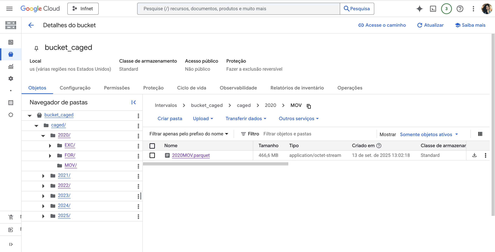

### Particionamento para otimização de consultas

Visando otimizar as consultas no Hive devido ao tamanho dos arquivos, outro processamento foi desenvolvido, dessa vez com ajuda de PySpark via Google Colab. Os scripts de transformação dos dados estão no arquivo `Transformacao_CAGED.ipynb`. 

Os arquivos gerados desta transformação que foram carregados na tabela fato do CAGED.
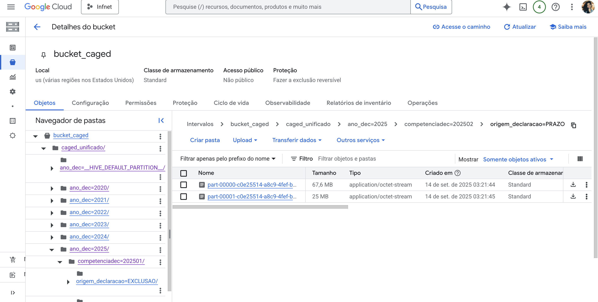

# Criação do Cluster no Dataproc

O cluster criado foi de nó único
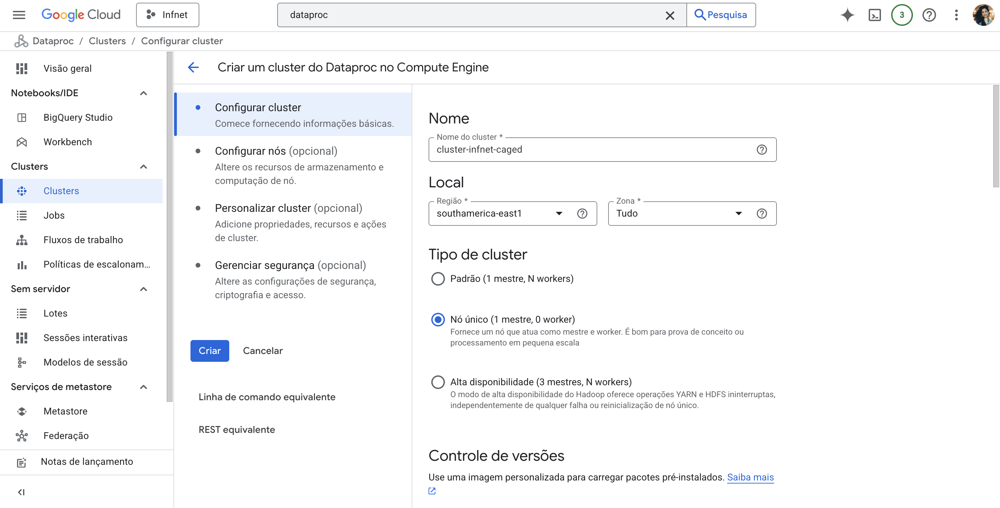

Criação da pasta HOME para o meu usuário:
```bash
hdfs dfs -mkdir /user/nathalia_branco
```
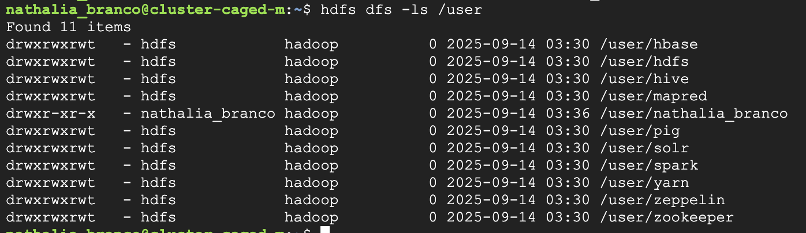

Acessando Hive via Beeline:
```bash
beeline -u jdbc:hive2://localhost:10000/default -n nathalia_branco -d org.apache.hive.jdbc.HiveDriver
```
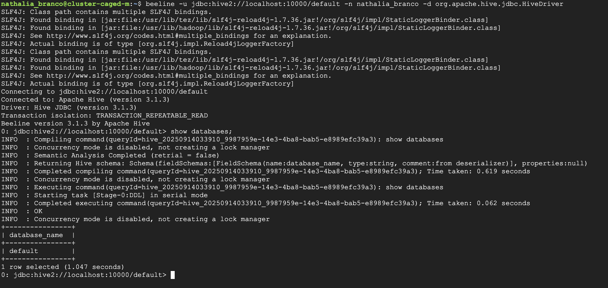

Criação da DATABASE:
```bash
CREATE DATABASE caged_db
LOCATION 'gs://bucket_caged/hive/caged_db/';
```
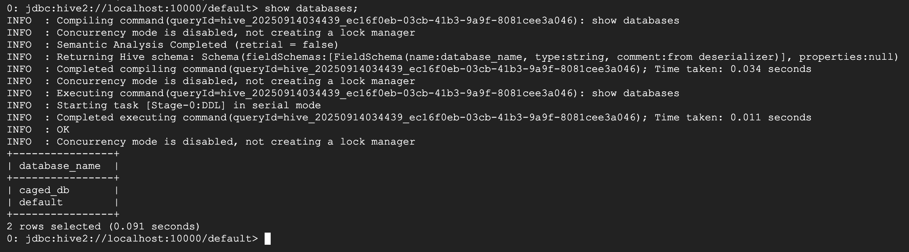

Describe na database:
```bash
DESCRIBE DATABASE caged_db;
```
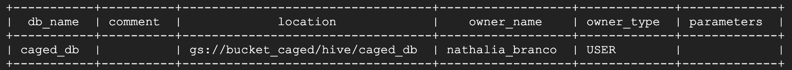

# Criação de tabelas no Hive

## Tabela Fato: Admissões e demissões

- No GCS: `gs://bucket_caged/caged_unificado/`

### Script para tabela no Hive
```sql
CREATE EXTERNAL TABLE fato_caged (
  -- colunas originais
  competenciamov        STRING,
  competenciaexc        STRING,
  regiao                INT,
  uf                    INT,
  municipio             STRING,
  secao                 STRING,
  subclasse             STRING,
  cbo2002ocupacao       STRING,
  categoria             INT,
  graudeinstrucao       INT,
  idade                 INT,
  horascontratuais      STRING,
  racacor               INT,
  sexo                  INT,
  tipoempregador        INT,
  tipoestabelecimento   INT,
  tipomovimentacao      INT,
  tipodeficiencia       INT,
  indtrabintermitente   INT,
  indtrabparcial        INT,
  salario               DECIMAL(10,2),
  tamestabjan           INT,
  indicadoraprendiz     INT,
  origemdainformacao    INT,
  indicadordeforadoprazo INT,
  unidadesalariocodigo  INT,
  valorsalariofixo      DECIMAL(10,2),
  indicadordeexclusao   INT,

  -- novas colunas
  ano_mov               INT,
  natureza_evento       STRING,   -- admissao / desligamento
  impacto_saldo         INT       
)
PARTITIONED BY (
  ano_dec INT,                  -- ano da declaração
  origem_declaracao STRING,      -- PRAZO / FORA_PRAZO / EXCLUSAO
  competenciadec        STRING
)
STORED AS PARQUET
LOCATION 'gs://bucket_caged/caged_unificado/';

```

Carregar partições:
```sql
MSCK REPAIR TABLE fato_caged;
```
## Dimensões

## Região

- Arquivo: `dim_regiao.csv`
- No GCS: `gs://bucket_caged/dimensoes/dim_regiao/dim_regiao.csv`


### Script para tabela no Hive
```sql
CREATE EXTERNAL TABLE dim_regiao (
  regiao INT,
  descricao_regiao STRING
)
ROW FORMAT DELIMITED
FIELDS TERMINATED BY ','
STORED AS TEXTFILE
LOCATION 'gs://bucket_caged/dimensoes/dim_regiao/';
```

```sql
SELECT * FROM caged_db.dim_regiao LIMIT 10;
```

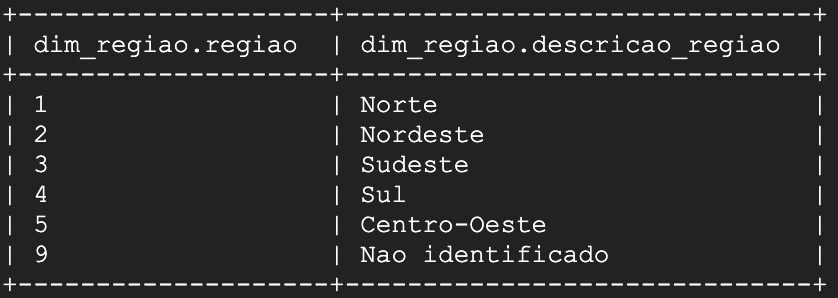

## UF

- Arquivo: `dim_uf.csv`
- No GCS: `gs://bucket_caged/dimensoes/dim_uf/dim_uf.csv`

### Script para tabela no Hive
```sql
CREATE EXTERNAL TABLE dim_uf (
  uf INT,
  descricao_uf STRING
)
ROW FORMAT DELIMITED
FIELDS TERMINATED BY ','
STORED AS TEXTFILE
LOCATION 'gs://bucket_caged/dimensoes/dim_uf/';
```
```sql
SELECT * FROM caged_db.dim_uf LIMIT 10;
```
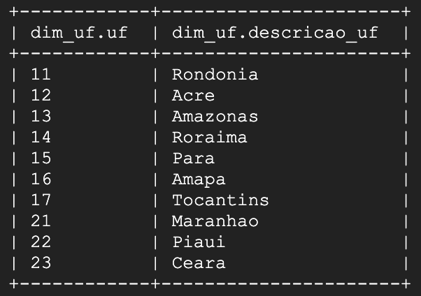

## Seção
- Arquivo: `dim_secao.csv`
- No GCS: `gs://bucket_caged/dimensoes/dim_secao/dim_secao.csv`

### Script para tabela no Hive
```sql
CREATE EXTERNAL TABLE dim_secao (
  secao STRING,
  descricao_secao STRING
)
ROW FORMAT DELIMITED
FIELDS TERMINATED BY ';'
STORED AS TEXTFILE
LOCATION 'gs://bucket_caged/dimensoes/dim_secao/';
```

```sql
SELECT * FROM caged_db.dim_secao LIMIT 10;
```
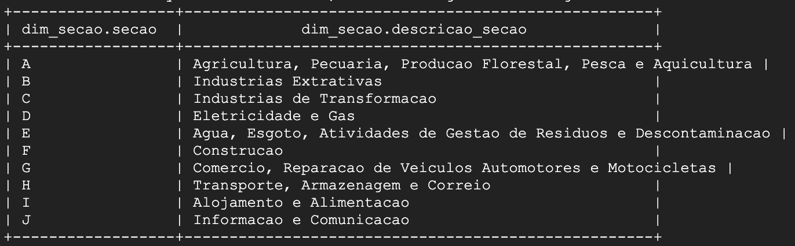

## Motivo de movimentação (Admissão ou demissão)

- Arquivo: `dim_motivo.csv`
- No GCS: `gs://bucket_caged/dimensoes/dim_motivo/dim_motivo.csv`

### Script para tabela no Hive
```sql
CREATE EXTERNAL TABLE dim_motivo (
  tipomovimentacao INT,
  descricao_motivo STRING
)
ROW FORMAT DELIMITED
FIELDS TERMINATED BY ';'
STORED AS TEXTFILE
LOCATION 'gs://bucket_caged/dimensoes/dim_motivo/';
```

```sql
SELECT * FROM caged_db.dim_motivo LIMIT 10;
```

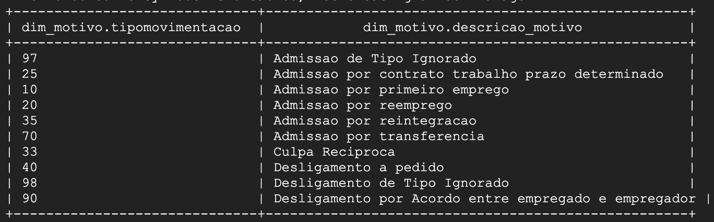

## Grau de instrução

- Arquivo: `dim_graudeinstrucao.csv`
- No GCS: `gs://bucket_caged/dimensoes/dim_graudeinstrucao/dim_graudeinstrucao.csv`

### Script para tabela no Hive
```sql
CREATE EXTERNAL TABLE dim_graudeinstrucao (
  graudeinstrucao INT,
  descricao_instrucao STRING
)
ROW FORMAT DELIMITED
FIELDS TERMINATED BY ';'
STORED AS TEXTFILE
LOCATION 'gs://bucket_caged/dimensoes/dim_graudeinstrucao/';
```

```sql
SELECT * FROM caged_db.dim_graudeinstrucao LIMIT 10;
```

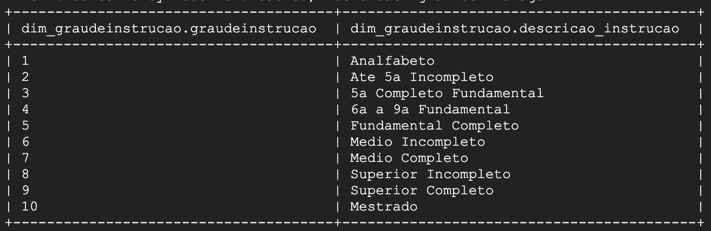

## CBO - Classificação Brasileira de Ocupação

- Arquivo: `dim_cbo.csv`
- No GCS: `gs://bucket_caged/dimensoes/dim_cbo/dim_cbo.csv`

### Script para tabela no Hive
```sql
CREATE EXTERNAL TABLE dim_cbo (
  cbo STRING,
  descricao_cbo STRING
)
ROW FORMAT DELIMITED
FIELDS TERMINATED BY ';'
STORED AS TEXTFILE
LOCATION 'gs://bucket_caged/dimensoes/dim_cbo/';
```

```sql
SELECT * FROM caged_db.dim_cbo LIMIT 10;
```

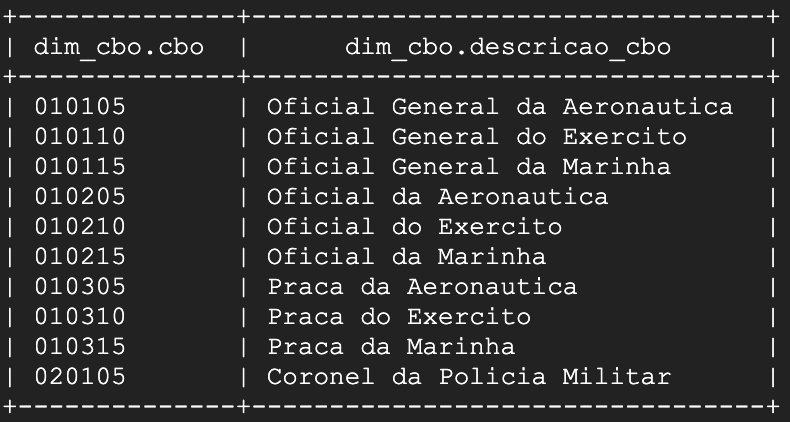

## Todas as tabelas no Hive:
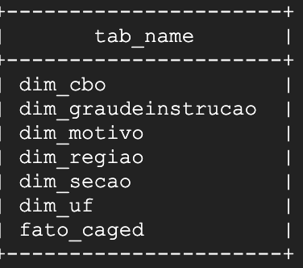

# Respondendo perguntas com Hive

### 1. Admissões e desligamentos

- Quantas admissões e desligamentos ocorreram em cada ano?
- Qual foi o principal motivo de movimentação em cada ano?

```sql
SELECT 
    f.ano_dec,
    m.descricao_motivo,
    COUNT(*) AS qtd_mov
FROM fato_caged f
LEFT JOIN dim_motivo m
    ON f.tipomovimentacao = m.tipomovimentacao
GROUP BY f.ano_dec, m.tipomovimentacao, m.descricao_motivo
ORDER BY f.ano_dec, qtd_mov DESC;
```

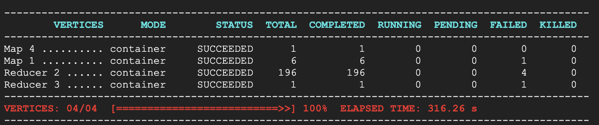
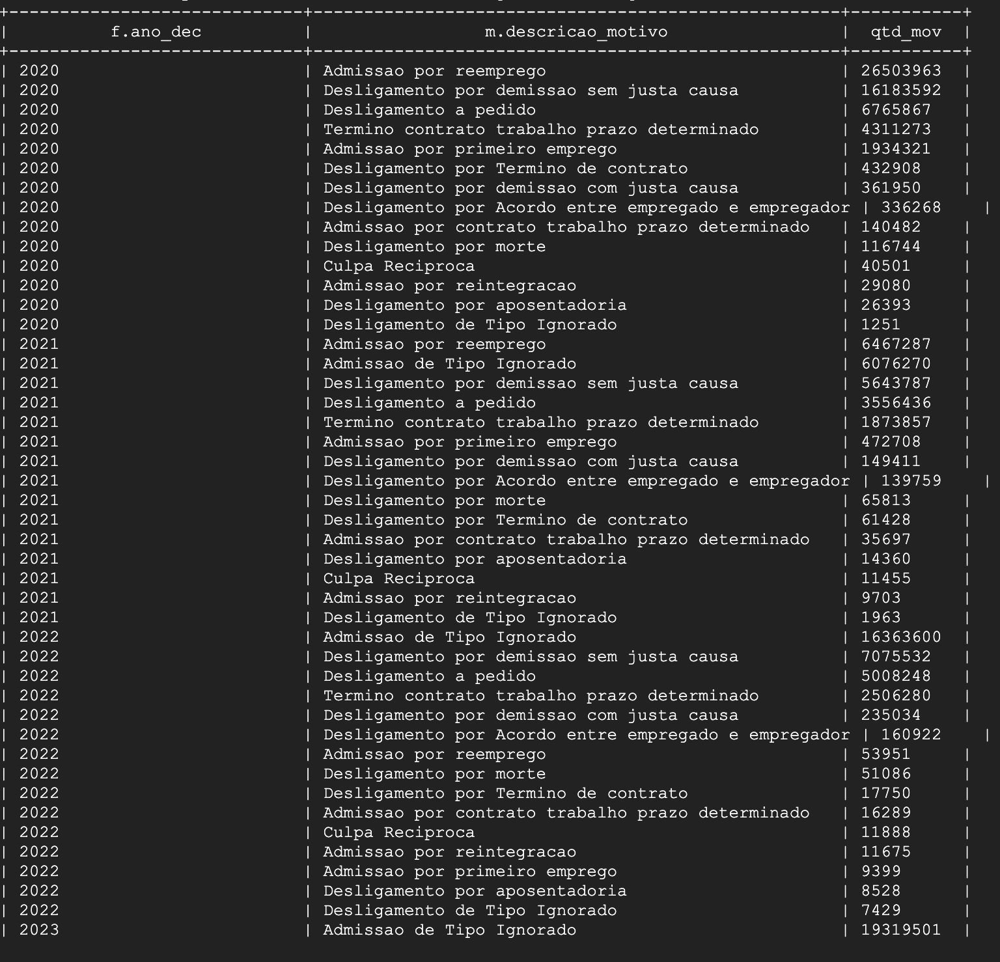
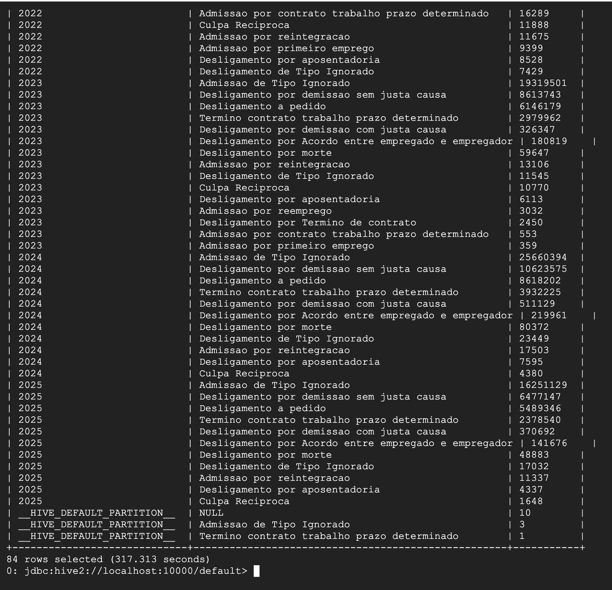

### 2. Saldo de movimentações por região e UF

- Quais regiões geraram mais empregos ao longo do período analisado?
- Em quais estados o saldo de empregos foi mais positivo ou negativo?
- Existe alguma concentração de saldo de empregos em determinada região do país?
```sql
SELECT 
    r.descricao_regiao,
    u.descricao_uf,
    SUM(f.saldomovimentacao) AS saldo_emprego
FROM fato_caged f
LEFT JOIN dim_regiao r
    ON f.regiao = r.codigo
LEFT JOIN dim_uf u
    ON f.uf = u.codigo
GROUP BY r.descricao_regiao, u.descricao_uf
ORDER BY saldo_emprego DESC;
```
### 3. Distribuição por setor econômico

- Quais setores da economia mais contrataram ou desligaram trabalhadores?
- Qual setor apresentou o maior saldo líquido de empregos?
- Há setores que consistentemente apresentam saldos negativos?

```sql
SELECT 
    s.descricao_secao,
    COUNT(*) AS qtd_mov,
    SUM(f.saldomovimentacao) AS saldo_emprego
FROM fato_caged f
LEFT JOIN dim_secao s
    ON f.secao = s.secao
GROUP BY s.descricao_secao
ORDER BY saldo_emprego DESC;
```
### 4. Escolaridade dos admitidos

- Qual é o nível de escolaridade predominante entre os admitidos?
- O perfil de escolaridade dos admitidos mudou ao longo dos anos?
- Trabalhadores com ensino superior têm participação relevante nas admissões?

```sql
SELECT 
    g.descricao_graudeinstrucao,
    COUNT(*) AS qtd
FROM fato_caged f
LEFT JOIN dim_graudeinstrucao g
    ON f.graudeinstrucao = g.codigo
WHERE f.tipomovimentacao IN (10, 20, 25, 35, 70) -- códigos de admissão
GROUP BY g.descricao_graudeinstrucao
ORDER BY qtd DESC;
```
### 5. Faixa etária × Motivo da movimentação

- Qual faixa etária concentra mais admissões?
- Qual faixa etária apresenta mais desligamentos a pedido?
- Jovens (até 24 anos) são mais contratados em primeiro emprego ou em reemprego?
- Trabalhadores acima de 60 anos são desligados majoritariamente por aposentadoria ou por outros motivos?

```sql
SELECT 
    f.faixa_etaria,
    m.descricao_motivo,
    COUNT(*) AS qtd_mov
FROM fato_caged f
LEFT JOIN dim_motivo m
    ON f.tipomovimentacao = m.codigo
GROUP BY f.faixa_etaria, m.descricao_motivo
ORDER BY f.faixa_etaria, qtd_mov DESC;
```
### 6. Ranking de ocupações (CBO)

- Quais ocupações mais geraram movimentações no período analisado?
- Quais cargos mais contribuíram para o saldo positivo de empregos?
- Existem ocupações com grande volume de admissões mas também alto volume de desligamentos?

```sql
SELECT 
    c.descricao_cbo,
    COUNT(*) AS qtd_mov,
    SUM(f.saldomovimentacao) AS saldo_emprego
FROM fato_caged f
LEFT JOIN dim_cbo c
    ON f.cbo2002ocupacao = c.cbo
GROUP BY c.descricao_cbo
ORDER BY saldo_emprego DESC
LIMIT 20;
```

# Proposta de evolução do trabalho

- Inclusão de novas dimensões para aumentar a qualidade da análise (considerar todas as dimensões do dicionário de dados).
- Inclusão de novas bases de dados como RAIS e IBGE.
- Entrega de resultados em ferramenta de DataViz como Google Looker Studio.
